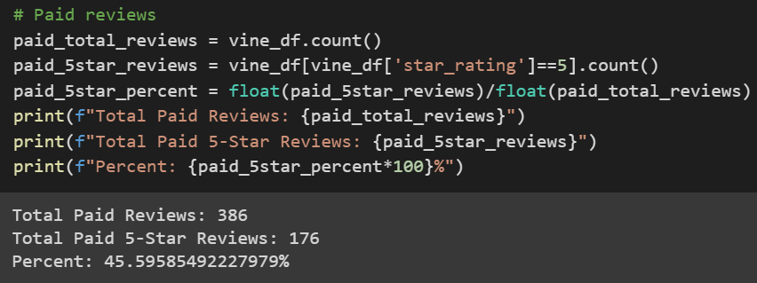
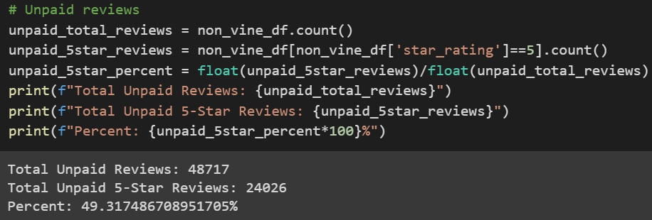
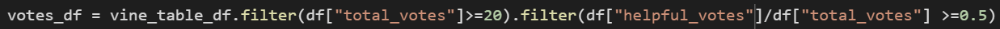
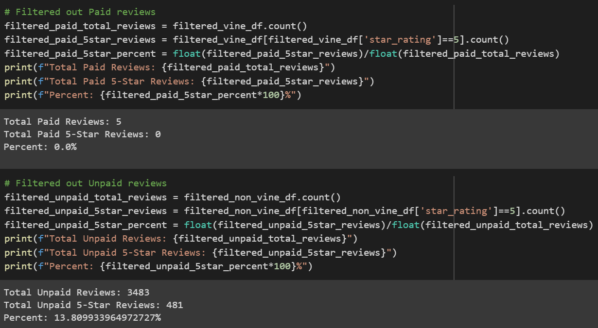

# Amazon_Vine_Analysis
PySpark, AWS, SQL, BigData, Hadoop

## Overview
The purpose of this analysis was to import, connect, and filter a dataset of Amazon product reviews and determine if there was a bias between paid and unpaid reviews and 5-star ratings. 

## Results
### Paid (Vine) review summary:
* Total Paid Reviews: 386
* Total Paid 5-Star Reviews: 176
* Percent: 45.59585492227979%


### Unpaid (Non-Vine) review summary:
* Total Unpaid Reviews: 48717
* Total Unpaid 5-Star Reviews: 24026
* Percent: 49.317486708951705%



## Summary
My initial hypothesis for this analysis was that paid reviews would be significantly skewed towards a 5-star rating, but after performing the analysis I have found that might not be the case. According to the results and prescribed methods, unpaid reviews were actually ~4% more likely to be a 5-star rating. However, this could be attributed to the method of filtering the data with the criteria of helpful/total votes, as seen below: 


This code filters out reviews that were seen as "unhelpful". My conclusion here is that the people voting on whether or not the review is helpful are able to identify which reviews are paid, and are more likely to flag it as "not helpful", which removes it from our data set. We can verify this by re running the code, but with the inverse selection: 
```Python
.filter(df['helpful_votes']/df['total_votes'] <= 0.5)
```

Here, we would be able to see the skew of the data that was filtered out:



After running the above analysis, we can see that the paid reviews were not significantly affected by the filter, and the unpaid reviews were mostly non-5-star reviews, which helps us conclude that, against my initial hypothesis, that when it comes to the Lawn and Garden department Amazon product reviews, that **there is not a significant bias towards paid vs unpaid reviews and 5-star ratings.** 